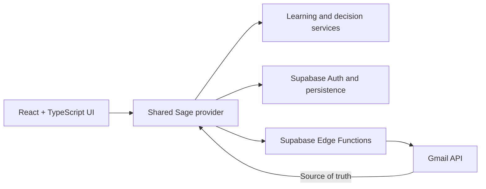

<p align="center">
  Sage is a private repository. I'm happy to give a live demo or grant read-only access to anyone who's interested—just reach out at ejonofrio@gmail.com.
</p>

<p align="center">
  
</p>

<h1 align="center">Sage</h1>

<p align="center">
  <strong>Clear mind, clear inbox.</strong>
</p>

<p align="center">
  A calm, learning-first Gmail client that helps people focus on important messages,
  understand their inbox, and handle repetitive email with less effort.
</p>

<p align="center">
  <a href="https://github.com/Firefly-2953/sage/actions/workflows/quality.yml">
    
  </a>
</p>

## Overview

Sage is a full-stack Gmail productivity application built around a simple principle: email software should reduce decisions instead of creating more of them.

Gmail remains the source of truth for messages, labels, and mailbox state. Sage provides a calmer interface on top, adding prioritization, explainable categorization, behavior learning, reversible actions, and carefully controlled automation.

Sage learns gradually. It observes repeated decisions, presents understandable suggestions, and waits for the user’s approval before remembering a preference or changing Gmail.

## Highlights

| Area | What Sage provides |
|---|---|
| **Today** | A focused overview of messages requiring attention, configurable Focus Areas, and a Daily Brief |
| **Inbox** | Gmail-backed mailboxes, search, progressive synchronization, bulk actions, Compose, and a shared email reader |
| **Important** | Explainable Sage priority that remains distinct from Gmail Important and Starred |
| **Learning** | Behavior suggestions, category corrections, accepted preferences, clarification questions, and reviewed automation |
| **Handled** | Explicit one-click shortcuts for qualified Archive, Mark read, and existing-label actions |
| **Adaptive actions** | Opt-in quick-action personalization based on strong, independent evidence |
| **Activity** | Human-readable action history with durable, relationship-aware Undo |
| **Accounts and Settings** | Separate Google identity and Gmail consent, synchronized preferences, and conservative account isolation |
| **Sample mode** | A deterministic, write-free product demonstration across Sage’s primary surfaces without mixing with real account data |

## Learning without losing control

Sage’s learning flow is intentionally gradual:

```text
Observe repeated behavior
        ↓
Identify a supported pattern
        ↓
Explain the evidence
        ↓
Ask the user to review it
        ↓
Remember only after approval
        ↓
Offer an explicit, reversible shortcut
```

A remembered preference does not automatically grant permission to mutate Gmail.

When Sage offers a shortcut, it names the exact effect:

- **Handle · Archive**
- **Handle · Mark read**
- **Handle · Label: Receipts**

Each message must still pass current evidence, policy, ownership, classification, and protection checks. Conflicting or uncertain situations cause Sage to abstain.

Broader Learning V3 work remains authority-free research. It cannot mutate Gmail, publish product recommendations, or become persistent user knowledge.

## Gmail experience

Sage currently supports:

- Gmail-backed Inbox, Sent, Drafts, All Mail, Spam, and Trash
- Quick, Recent, and Full Inbox synchronization
- Gmail History incremental updates
- Provider-backed Gmail search
- Plain-text Compose with multiple recipients
- Mark read and unread
- Archive and Move to Inbox
- Star and unstar
- Mark and remove Gmail Important
- Move to and restore from Trash
- Mark and remove Spam
- Apply, remove, and create Gmail labels
- Explicitly reviewed Gmail filters through Teach Sage
- Optimistic updates, rollback, feedback, Activity, and Undo

Opening a message does not implicitly change its read state. Permanent deletion is not implemented.

## Architecture



Core architectural boundaries:

- Gmail owns messages and mailbox state.
- Sage stores preferences, learning records, settings, Activity, and processing metadata.
- Gmail actions use one shared execution pipeline.
- Meaningful actions flow through the centralized Activity system.
- Account and session ownership are revalidated across asynchronous work.
- Suggestions, remembered knowledge, Handled shortcuts, and Gmail automation represent separate levels of authority.
- No LLM determines whether a Gmail mutation is authorized.
- The production container contains only the compiled frontend and static Nginx runtime; Gmail and Supabase remain externally managed services.

## Technology

- React 19
- TypeScript 6
- Vite 8
- React Router 7
- Supabase Auth, PostgreSQL, Row Level Security, and Edge Functions
- Google Identity Services
- Gmail API
- Docker and Docker Compose
- Unprivileged Nginx runtime
- GitHub Actions CI
- Trivy runtime vulnerability scanning
- Dependabot
- Lucide icons
- Plain CSS
- Node’s native test runner
- PGlite migration and persistence-contract testing
- Chrome DevTools Protocol for mounted browser and accessibility tests

## Trust and privacy

Sage is designed to avoid becoming a competing email database.

- Gmail OAuth credentials stay server-side.
- Refresh and short-lived access tokens are encrypted at rest.
- Browser roles cannot read server credential tables.
- Raw Gmail API responses are not persisted.
- Message bodies, snippets, attachments, recipient fields, and full headers are not stored in Sage’s persistence layer.
- Activity and learning records retain only the limited metadata required for explanation, lifecycle tracking, and Undo.
- Gmail filters are created only after explicit review and approval.
- Sage does not silently adopt or delete externally managed Gmail filters.
- Autonomous background Gmail actions remain outside the current product scope.
- Rich sample mode is synthetic, session-isolated, and unable to write to Gmail, Supabase, canonical Activity, Learning, or persistence.

## Quality

Sage has more than **3,000 automated tests** covering:

- Gmail actions and synchronization
- Authentication and account isolation
- Persistence revisions and offline replay
- Learning qualification and evidence
- Activity and durable Undo
- Filter ownership and recovery
- Responsive layouts
- Native keyboard interaction
- Dialog containment and focus restoration
- Mounted Chrome behavior
- Migration and security contracts
- Sample-data isolation
- Production-build exclusions
- Docker routing, health, caching, and cleanup contracts

The GitHub Actions CI workflow runs the project on Node 24 and verifies:

```bash
npm ci
npm run lint
npm run build
npm test
```

It also:

- Builds the production Docker image
- Smoke-tests every current application route
- Verifies SPA fallback and static-resource 404 behavior
- Checks cache and security headers
- Confirms non-root execution
- Exercises health failure and recovery
- Tests container and network cleanup paths
- Scans the final runtime image with Trivy for fixable High and Critical OS vulnerabilities

The Docker bases, security scanner, and GitHub Actions are pinned to immutable digests or commit SHAs and updated through Dependabot.

## Current status

Sage V1 and Learning V2 have completed bounded automated and authenticated acceptance in a personal/test-account environment.

Current production behavior includes explicit Handled shortcuts for Archive, Mark read, and applying an existing label, plus opt-in adaptive quick actions. These features remain user-initiated and use Sage’s shared Gmail action, Activity, and durable Undo systems.

Learning V3 remains authority-free shadow research rather than a shipped user feature. Current development is focused on production polish, responsive screenshot readiness, broader learning research, and preparation for an intentional public rollout.

The application has not yet been prepared for broad public distribution. Public launch work will require production-origin configuration, OAuth verification, privacy and terms review, monitoring, and a controlled rollout plan.

## Run locally

### Requirements

- Node.js 24 or newer
- npm
- A Google OAuth web client
- A Supabase project for authentication, persistence, and server-side Gmail access

Install the locked dependencies:

```bash
npm ci
```

Create the local environment file:

```bash
cp .env.example .env.local
```

Add the public client configuration:

```dotenv
VITE_GOOGLE_CLIENT_ID=your-web-client-id.apps.googleusercontent.com
VITE_SUPABASE_URL=https://your-project-ref.supabase.co
VITE_SUPABASE_ANON_KEY=your-public-anon-or-publishable-key
```

Start Sage:

```bash
npm run dev
```

Vite serves the application at:

```text
http://localhost:5173
```

Never place a Google client secret, Supabase service-role key, Gmail token, encryption key, or another private credential in a `VITE_` variable.

## Run with Docker

Sage uses a digest-pinned, multi-stage Docker build. Node 24 compiles the React application, and only the resulting static files enter the small, unprivileged Nginx runtime.

Run:

```bash
docker compose --env-file .env.local up --build
```

Open [http://localhost:5173](http://localhost:5173).

Stop and remove the local container and network with:

```bash
docker compose down
```

The host port intentionally remains `5173`. Add `http://localhost:5173` to the Google OAuth client’s **Authorized JavaScript origins** and the Edge Function `SAGE_APP_ORIGINS` allowlist.

Gmail’s OAuth callback remains the deployed Supabase Edge Function URL. It is not handled by the static frontend container.

Compose supplies these public browser values as build-time inputs:

- `VITE_GOOGLE_CLIENT_ID`
- `VITE_SUPABASE_URL`
- `VITE_SUPABASE_ANON_KEY`

Vite compiles them into the frontend bundle; they are not runtime secrets. `.env.local` is excluded from the Docker build context.

The final image:

- Runs as UID/GID `101:101`
- Contains only the compiled frontend and Nginx runtime
- Provides `/healthz`
- Supports direct navigation and refresh across Sage routes
- Uses immutable caching for successful fingerprinted assets
- Returns real, uncached `404` responses for missing static files
- Adds baseline content-type, referrer, and anti-framing headers
- Excludes source, tests, vault documents, development tools, credentials, backend files, private Learning V3 bridges, diagnostics, and acceptance fixtures

It does not containerize Gmail, Supabase, PostgreSQL, migrations, or Edge Functions.

Useful checks:

```bash
curl --fail http://localhost:5173/healthz
docker compose ps
docker compose logs web
```

If sign-in is rejected, verify the exact `http://localhost:5173` origin in both Google and `SAGE_APP_ORIGINS`, then rebuild after changing any `VITE_` value.

## Google and Supabase setup

Sage separates Google identity from Gmail authorization:

1. **Sign in with Google** establishes the Sage/Supabase identity.
2. **Connect Gmail** begins a separate server-side OAuth authorization flow.
3. Gmail credentials remain encrypted behind Supabase Edge Functions.
4. Explicit Gmail actions are performed through that server boundary.

The Gmail integration uses:

```text
https://www.googleapis.com/auth/gmail.modify
https://www.googleapis.com/auth/gmail.settings.basic
```

Apply the migrations in `supabase/migrations/` in filename order.

For complete OAuth, Supabase, Edge Function, redirect URI, secret, and deployment instructions, see [Gmail server authorization](docs/gmail-server-authorization.md).

## Useful commands

```bash
npm run dev
npm test
npm run build
npm run lint
npm run preview
```

Focused test suites are also available:

```bash
npm run test:classifier
npm run test:gmail
npm run test:activity
npm run test:patterns
npm run test:stability
npm run test:sync
npm run test:production
npm run test:auth
npm run test:accessibility
```

## Project documentation

Sage maintains a durable project knowledge vault alongside the implementation:

- [Product overview](docs/Sage/00%20-%20Sage%20Overview.md)
- [Current state](docs/Sage/01%20-%20Current%20State.md)
- [Product decisions](docs/Sage/02%20-%20Product%20Decisions.md)
- [Architecture](docs/Sage/03%20-%20Architecture.md)
- [Bugs and lessons](docs/Sage/04%20-%20Bugs%20and%20Lessons.md)
- [Backlog](docs/Sage/05%20-%20Backlog.md)
- [Tab audits](docs/Sage/06%20-%20Tab%20Audits.md)
- [V1 release acceptance](docs/Sage/08%20-%20V1%20Release%20Acceptance.md)
- [Learning V2 acceptance](docs/Sage/09%20-%20Learning%20V2%20Acceptance.md)
- [Learning V3 research](docs/Sage/10%20-%20Learning%20V3%20Research.md)

## Roadmap

Future directions include:

- Additional Handled actions
- Broader explainable learning patterns
- AI-assisted summaries and semantic importance
- Action-item and calendar extraction
- Package intelligence
- Contact-aware Compose
- Smart, explicitly reviewed automation
- Unified multi-account inboxes

Every addition should make Sage feel calmer, smarter, or more trustworthy.

## Home Page


## Inbox


## Important


## Learning 


## Teaching Sage


## Activity


## Settings 


